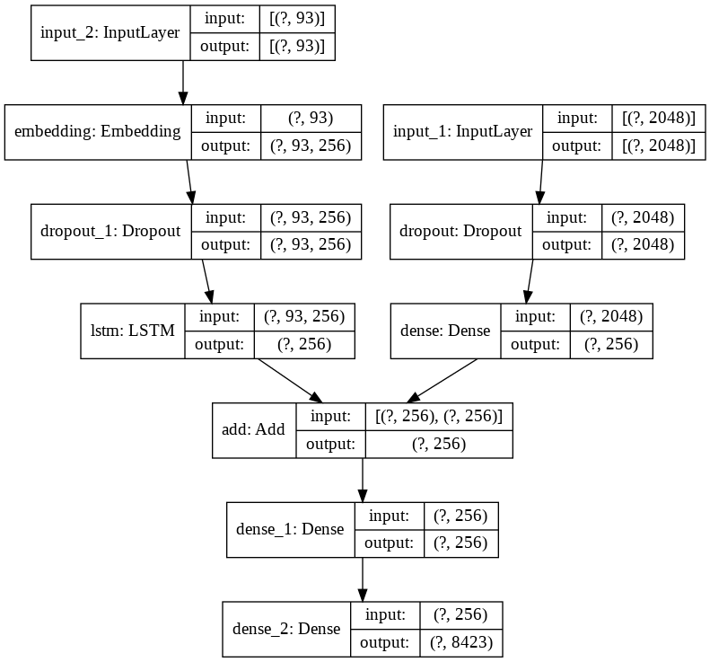

# Image Caption Generator
 
Given an image, generates a caption for it using two different neural networks; Convolutional Neural Network (CNN) and Long Short Term Memory Network (LSTM).

It uses transfer learning using Xception model to leverage the model's trained parameters to encode an image to a 2048 feature vector which is then fed into an LSTM to predict a caption based on the features extracted by Xception.
  

## Model Architecture
 

</img>
  

- We remove the last layer of Xception network
- Image is fed into this modified network to generate a 2048 length encoding corresponding to it
- The 2048 length vector is then fed into a second neural network along with a caption for the image (while training)
- This second network consists of an LSTM which tries to generate a caption for the image
